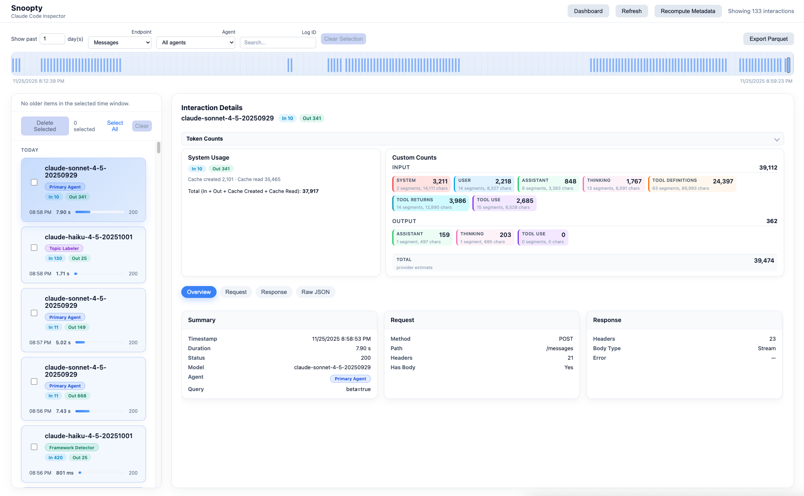
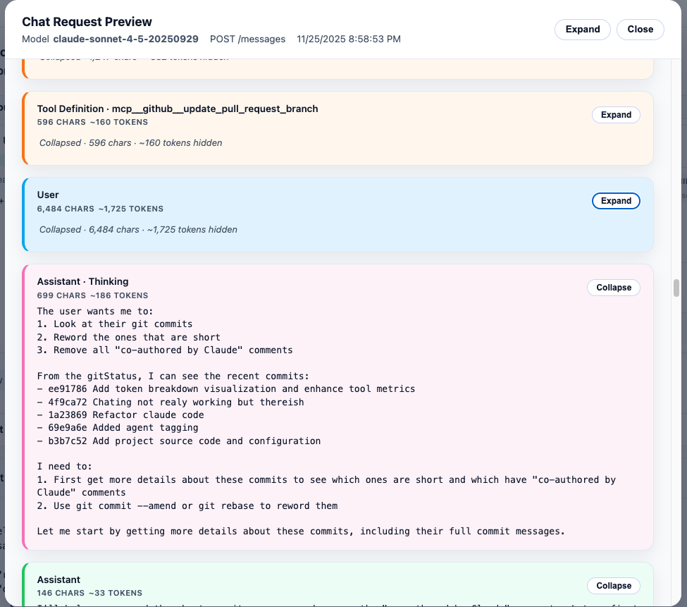
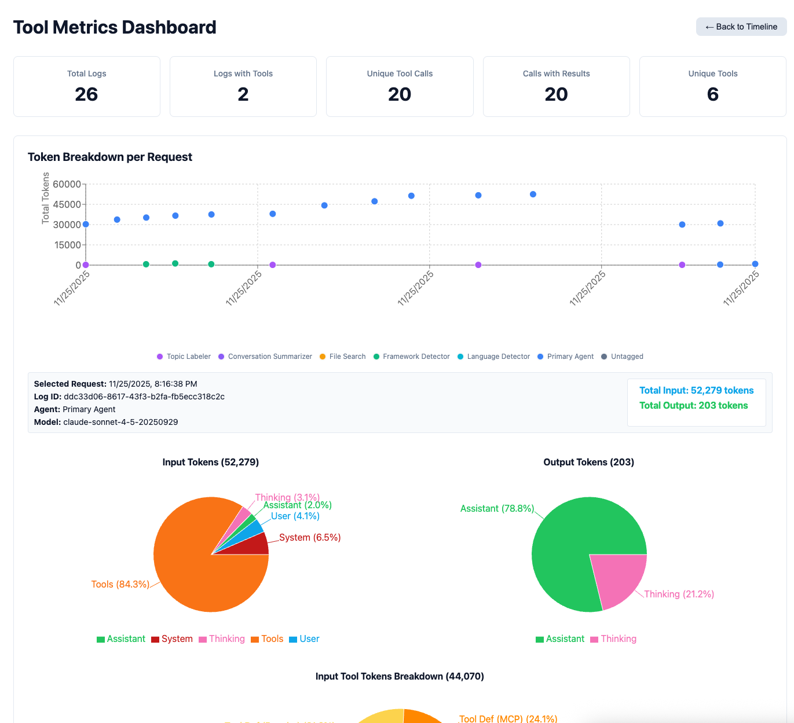

# Snoopty


What to know exactly what Claude Code is doing? Snoopty is a proxy server and visualization tool for Claude Code. Snoopty intercepts API requests from Claude Code, logs all interactions locally, and provides an interactive dashboard to analyze usage patterns, token consumption, and tool usage.

## Features

### Timeline View of All Requests and Responses


See all the messages from Claude Code with agent tagging, token counts, and various UX filtering mechanisms.

For token counts, we show the counts returned from Anthropic under `System Usage` and then show our custom token counting at a finer granularity under `Custom Counts`.

### Detailed Request View


For a single request, see in details each component, each tool, and estiamted token usage.

### Dashboards


For a given selection of logs, look at aggregate metrics of token counts and tool usage. You can even dive into MCP versus Anthropic Default tools.

### Download to Parquet
What to do analysis elsewhere, hit the download to parquet function to get a dump of logs into a log dump. The logs dumped will only be those selected/filtered in the current view.

## Quick Start

### Prerequisites

- Node.js 18+
- An Anthropic API key

### Installation

```bash
npm install
```

### Configuration

Create a `.env` file from `.env.example`:

```env
UPSTREAM_API_KEY="sk-ant-XXX"
UPSTREAM_BASE_URL=https://api.anthropic.com
PORT=8787
LOG_DIR=logs
LOG_LEVEL=info  # Options: debug, info, warn, error (default: info)
```

**Configuration options:**
- `UPSTREAM_API_KEY`: Your Anthropic API key (required)
- `UPSTREAM_BASE_URL`: Anthropic API endpoint (default: https://api.anthropic.com)
- `PORT`: Port for the proxy server (default: 8787)
- `LOG_DIR`: Directory for storing interaction logs (default: logs)
- `LOG_LEVEL`: Logging verbosity level (default: info)
  - `debug`: Verbose output including all internal operations
  - `info`: Normal operation logs (proxy requests, startup/shutdown, important events)
  - `warn`: Warnings and errors only
  - `error`: Errors only

### Running

#### Development Mode (with hot-reload)

In development, you need to run **two separate servers**:

```bash
# Terminal 1 - Backend proxy server (port 8787)
npm run dev

# Terminal 2 - Frontend development server (port 5173)
npm run dev:ui
```

**What's happening:**
- **Backend server** (`npm run dev`) on port 8787:
  - Proxies all `/v1/*` requests to Anthropic API
  - Logs interactions to `logs/` directory
  - Provides REST API endpoints at `/api/logs`
  - Runs background workers for metrics processing
  - Does NOT serve the UI in development mode

- **Frontend server** (`npm run dev:ui`) on port 5173:
  - Serves the React UI with hot module replacement
  - Automatically proxies API calls to backend on port 8787
  - Access the UI at `http://localhost:5173`

#### Production Mode

In production, everything runs from a single server:

```bash
# Build both backend and frontend
npm run build

# Run the production server (port 8787)
npm start
# Or explicitly set NODE_ENV for production mode:
# NODE_ENV=production npm start
```

**Note:** The server automatically detects production mode when:
- `NODE_ENV=production` is set, OR
- Running compiled JavaScript (not via ts-node-dev)
- If you see a development mode message at `/ui`, ensure you've run `npm run build` first

### Using the Proxy

Configure Claude Code to use Snoopty as the API endpoint:

```bash
# Use Snoopty proxy (always port 8787 for API, regardless of dev/prod mode)
# Yes, you need to give the API key here again.
ANTHROPIC_BASE_URL=http://localhost:8787 ANTHROPIC_API_KEY="sk-ant-XXX" claude
```

**Note:** Claude Code may complain about needing to logout. You can safely ignore this message - it will still work.

All requests will be forwarded to Anthropic and logged locally in the `logs/` directory.

### Accessing the UI

- **Development:** Open `http://localhost:5173/ui/` in your browser
- **Production:** Open `http://localhost:8787/ui/` in your browser

The UI will show all logged interactions, token usage, and provide analytics dashboards.


## Architecture

### Overview

Snoopty consists of two main components:

1. **Backend Proxy Server** (Node.js + Express + TypeScript)
   - Intercepts API requests from Claude Code
   - Forwards requests to Anthropic API with your API key
   - Logs all interactions to JSON files
   - Processes metrics asynchronously in background workers
   - Serves REST API for the UI

2. **Frontend Dashboard** (React 19 + Vite)
   - Interactive timeline view of all requests
   - Token usage breakdown and analytics
   - Tool usage statistics
   - Export functionality (Parquet format)

### Data Flow

1. Claude Code sends request to `http://localhost:8787/v1/*`
2. Snoopty proxy:
   - Captures the request
   - Forwards to Anthropic API
   - Streams the response back to Claude Code
   - Logs the complete interaction to `logs/` directory
3. Background workers process logs to compute:
   - Token counts per role (system, user, assistant)
   - Tool usage metrics
   - Agent detection and tagging
4. UI polls `/api/logs` to display real-time data

### Key Directories

- `src/` - Backend TypeScript source
  - `proxy.ts` - Anthropic API proxy implementation
  - `logStore.ts` - Log management and querying
  - `metrics/` - Pluggable metrics analyzers
  - `workers/` - Background processing
- `client/` - Frontend React application
- `logs/` - JSON log files (one per API interaction)
- `dist/` - Built production files

## Special Thanks
Huge shout out to [Pydantic AI's Logifre](https://pydantic.dev/logfire). Their chat view was huge inspiration. Also thanks to [Hyperparam](https://hyperparam.app/home). I used their parquet view a lot in early investigations of logs.